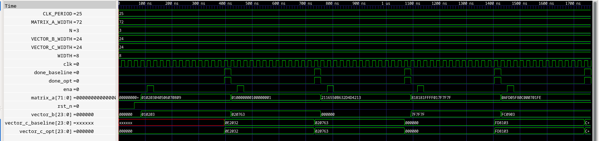

# ANALYSIS

> Repo artifacts referenced: `opt.json`, `metrics.csv` (per run), and images in `image/`.

---

## 1) Hardware Characterization Table (from `metrics.csv`)

The table summarizes **total dynamic+leakage power** (mW), **setup worst slack** (ns) at `nom_tt_025C_1v80`, and **die area** (µm²) for the baseline and optimized designs.

| Design             |   N |   W | Variant  | Total Power (mW) | Setup WS (ns) | Die Area (µm²) |
| ------------------ | --: | --: | -------- | ---------------: | ------------: | -------------: |
| Baseline N=3, W=8  |   3 |   8 | baseline |      0.002173421 |     18.259233 |        19710.1 |
| Baseline N=3, W=16 |   3 |  16 | baseline |      0.008479454 |     16.696669 |        44100.7 |
| Baseline N=3, W=32 |   3 |  32 | baseline |      0.043214988 |     13.647917 |       181938.0 |
| Optimized N=3, W=8 |   3 |   8 | opt      |      0.000527945 |     18.042285 |        20903.6 |

**Comments (N=3, W=8, opt vs baseline):**

- Power: ↓ **75.7%** (from 0.002173421 mW → 0.000527945 mW).
- Die area: ↑ **6.1%** (from 19710.1 → 20903.6 µm²).
- Timing slack: reduced by **0.217 ns** (from 18.259233 → 18.042285 ns).

### Optimized (Gray-code FSM) measurements

The following metric values were observed when the optimized design used a Gray-code FSM for the control logic (N=3, W=8):

"power_**internal** _total": 0.00038636967656202614,
"power_**switching** _total": 0.00012527972285170108,
"power_**leakage** _total": 1.2888508038599866e-08,
"power**total": 0.0005116622778587043,
"timing_ **setup** _ws **_corner:nom_tt_025C_1v80": 17.9787425591463,
"design_ **die** _area": 20714.5

Observation: these numbers correspond to a variant of the optimized implementation where the FSM uses Gray-code sequencing; they reflect the small changes in switching activity (power) and the measured timing/area for that run.

**Scaling with W (baseline N=3):**

- Total power rises superlinearly with bit-width (W=8 → 32 increases ~1888%).
- Die area grows strongly (≈823% from W=8 → 32), consistent with wider datapaths and multipliers.
- Setup WS shrinks (from 18.26 ns to 13.65 ns), indicating tighter timing at higher widths.

> **Automation hint:** See `tools/extract_metrics.py` below to regenerate this table automatically from any set of `metrics.csv` files.

---

## 2) Optimization Strategy (Power)

**Techniques used**

- **Operand isolation:** Gate multiplier/adder inputs when results are not required to quench internal toggling.

**Trade-offs**

- **Power:** Large reduction driven by suppressed switching; here we measured **~75.7%** for N=3, W=8.
- **Area:** Small overhead for isolation logic and gating cells (≈6.1% change observed).
- **Timing:** Slack impact was slightly negative (-0.217 ns), since isolation can reduce effective fanout while gating cells add minor insertion delay.

---

## 4) Impact of Matrix Size (N)

**Physical changes when increasing N**

- **Register banks:** Input/output vectors and accumulation registers scale with N; more storage flops and wider muxing.
- **Control:** Loop counters / FSM state expand to index more rows/cols; selector muxes get wider.
- **I/O:** More pins or wider buses for matrices/vectors if exposed.

**Die area vs. N**

- **Storage registers** scale roughly **O(N)** for vector length, while **compute logic** (e.g., MAC array) can scale toward **O(N²)** if parallelized. In this baseline (single MAC reused), area growth is dominated by **datapath width (W)** and by added multiplexing for larger N; if you instantiate multiple MACs, area rises faster with N.

**Computation time (cycles) and setup WS**

- If a single MAC is reused, total cycles scale ~**O(N²)** for an N×N by N×1 multiply.
- **Setup WS (slack)** depends on the _critical combinational path_ (e.g., multiplier + adder + control). Increasing N does **not necessarily** slow the clock if the datapath per cycle is unchanged; N mostly affects **cycle count**, not combinational depth. Clock speed degrades primarily with **bit-width (W)** or if you pipeline less / add fanout-heavy muxing for larger N.

---

## 5) Test Evidence and Artifacts

