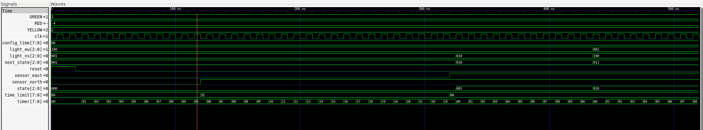
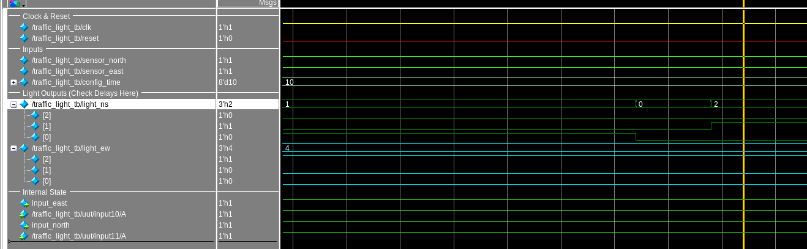
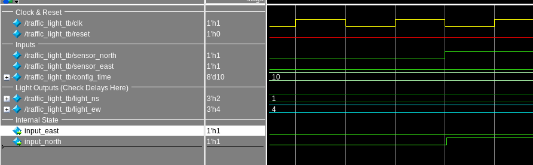

# ANALYSIS.md: Timing Closure & Optimization

---

## 1. Slack & Budget Analysis

_Analysis of results from the Fail Run (Step 2)_

### The Constraint Effect

**Why did adding the SDC file cause the slack to drop from Positive to Negative, even though the Verilog didn't change?**

In the baseline run (without SDC), the synthesis tool assumes an "ideal" environment:

- Zero input delay
- Zero output delay
- Zero capacitive load on outputs

The signal has the **entire clock cycle** to propagate through combinational logic.

When the SDC file is introduced, it models **physical reality**:

| Constraint Type                      | Effect                                                   |
| ------------------------------------ | -------------------------------------------------------- |
| **Input Delays** (1.0 ns)      | Accounts for signals arriving late from external sensors |
| **Output Delays** (1.0 ns)     | Reserves time for the next chip to capture data          |
| **Clock Uncertainty** (0.2 ns) | Models jitter and skew in real clock networks            |

These constraints drastically reduce the effective time available for internal logic, causing the design to fail timing requirements that it easily passed under ideal conditions.

---

### The Time Budget

**Calculate the actual time available for internal logic:**

Using the formula: `T_logic = T_clk - T_input_delay - T_output_delay`

From `traffic_light.sdc`:

- `T_clk` = 4.2 ns (create_clock -period 4.2)
- `T_input_delay` = 1.0 ns (set_input_delay -max 1.0)
- `T_output_delay` = 1.0 ns (set_output_delay -max 1.0)

```
T_logic = 4.2 ns - 1.0 ns - 1.0 ns = 2.2 ns
```

**Available time for internal logic: 2.2 ns**

> [!NOTE]
> When including clock uncertainty (0.2 ns), the effective budget becomes: `2.2 - 0.2 = 2.0 ns`

---

### The Violation

**Worst Setup Slack from Fail Run:**

| Metric                                    | Value                              |
| ----------------------------------------- | ---------------------------------- |
| `timing__setup__ws` (Worst Setup Slack) | **-0.22854208061795903 ns** |

1. -0.22854208061795903

**How much faster did the logic need to be?**

If the Worst Setup Slack = `X` ns (negative), then the logic needed to be `|X|` ns faster to meet timing.

For example, if slack = -0.5 ns, the critical path needed to be reduced by 0.5 ns.

---

## 2. Optimization Trade-offs

_Analysis of results from the Success Run (Step 3)_

### The Fix

**Parameters added to `config_success.json`:**

| Parameter                         | Value         | Why This Setting?                                                                                                                                                     |
| --------------------------------- | ------------- | --------------------------------------------------------------------------------------------------------------------------------------------------------------------- |
| `SYNTH_STRATEGY`                | `"DELAY 0"` | Directs ABC synthesis tool to prioritize**delay minimization** over area. Maps logic using fastest possible cells (high-drive gates) rather than smallest ones. |
| `PL_RESIZER_SETUP_SLACK_MARGIN` | `0.2`       | Tells the placement resizer to "over-optimize" by targeting +0.2 ns slack instead of 0. Creates safety buffer for unpredictable routing delays.                       |
|                                   |               |                                                                                                                                                                       |

**Success Run Result:**

- `timing__setup__ws` (Worst Setup Slack): **0.104 ns** (Positive ✓)

---

### The Cost of Speed

**Area Comparison (`design__instance__area`):**

| Run         | Configuration                 | Design Area (µm²) |
| ----------- | ----------------------------- | ------------------- |
| Fail Run    | `SYNTH_STRATEGY: "AREA 0"`  | 1091.05             |
| Success Run | `SYNTH_STRATEGY: "DELAY 0"` | 1513.95             |

**Did the area increase?**

**Yes**

\***\*Why does achieving faster timing result in larger chip area?\*\***

1. **Larger Transistors:** Fast cells use larger transistors to drive higher currents (High Drive Strength), which physically occupy more silicon area.
2. **Buffer Insertion:** The tool inserts additional buffers to:

   - Break long nets into shorter segments
   - Drive high capacitive loads
   - Each buffer adds to total area
3. **Cell Selection:** Under `DELAY 0`, the tool selects from a library of "fast" cells that trade area for speed. A 2-input NAND with high drive strength can be 2-3x larger than a minimum-size version.
4. **Reduced Logic Sharing:** Speed optimization may duplicate logic to reduce fan-out, rather than sharing gates (which saves area but adds delay).

> [!IMPORTANT] > **Trade-off Summary:** Timing closure was achieved at the cost of increased silicon area. This is the fundamental area-delay trade-off in VLSI design.

---

## 3. Optimization Experiments

_Summary of all test runs performed to achieve timing closure_

### Experiment Progression

The following table documents each optimization attempt, showing the progression from baseline to final successful configuration:

| #  | Run Name                                                     | Configuration Tested                          | Result  | Key Insight                                          |
| -- | ------------------------------------------------------------ | --------------------------------------------- | ------- | ---------------------------------------------------- |
| 1  | `run_baseline`                                             | Default settings, no SDC                      | ✅ Pass | Baseline with ideal conditions passes                |
| 2  | `run_fail`                                                 | `AREA 0` strategy with SDC                  | ❌ Fail | Adding realistic constraints causes timing violation |
| 3  | `run_delay0_test`                                          | `DELAY 0` strategy                          | ❌ Fail | Strategy alone not sufficient                        |
| 4  | `run_delay0maxfanout5_test`                                | `DELAY 0` + `MAX_FANOUT 5`                | ❌ Fail | Limiting fanout helps but not enough                 |
| 5  | `run_delay0_maxfanout5_sizing1_test`                       | `DELAY 0` + `MAX_FANOUT 5` + `SIZING 1` | ❌ Fail | Gate sizing added                                    |
| 6  | `run_delay0maxfanout5_sizing1_glb`                         | Above + Global routing optimization           | ❌ Fail | Routing optimization attempted                       |
| 7  | `run_delay0maxfanout5_sizing1_glb_flatten`                 | Above +`FLATTEN`                            | ❌ Fail | Logic flattening to reduce levels                    |
| 8  | `run_glb_delay0_test`                                      | Global routing with DELAY 0                   | ❌ Fail | Different ordering of optimizations                  |
| 9  | `run_pl_test`                                              | Placement optimization                        | ❌ Fail | Placement-focused approach                           |
| 10 | `run_pl_glb_test`                                          | Placement + Global routing                    | ❌ Fail | Combined PL and routing                              |
| 11 | `run_synth_buffering_delay0_test`                          | `BUFFERING` + `DELAY 0`                   | ❌ Fail | Extra buffering attempted                            |
| 12 | `run_ultimate_test`                                        | Combined optimizations                        | ❌ Fail | Multiple settings together                           |
| 13 | `run_ultimate_sizing_test`                                 | Ultimate +`SIZING 1`                        | ❌ Fail | Added gate sizing                                    |
| 14 | `run_ultimate_sizing_maxfanout10_test`                     | Above +`MAX_FANOUT 10`                      | ❌ Fail | Relaxed fanout constraint                            |
| 15 | `run_ultimate_sizing_maxfanout10_flatten_test`             | Above +`FLATTEN`                            | ❌ Fail | Added flattening                                     |
| 16 | `run_ultimate_sizing_maxfanout10_flatten_clk_test`         | Above + clock optimization                    | ❌ Fail | Clock network optimization                           |
| 17 | `run_ultimate_sizing_maxfanout10_flatten_clk50_test`       | Above + different clock                       | ❌ Fail | Clock period adjustment                              |
| 18 | `run_ultimate_sizing_maxfanout10_flatten_clk50_setup_test` | Above +`SETUP_SLACK_MARGIN`                 | ❌ Fail | Setup margin added                                   |
| 19 | `run_ultimate_sizing_maxfanout5_flatten_clk50_setup_test`  | Tighter fanout (5) + all above                | ❌ Fail | Stricter fanout, setup margin                        |
| 20 | `run_final`                                                | **Final working configuration**         | ✅ Pass | `DELAY 0` + `SETUP_MARGIN 0.2`                   |
|    |                                                              |                                               |         |                                                      |

---

### Parameter Glossary

| Parameter                         | Description                         | Effect on Timing                                        |
| --------------------------------- | ----------------------------------- | ------------------------------------------------------- |
| `SYNTH_STRATEGY: "DELAY 0"`     | Prioritize speed over area          | Faster cells, larger area                               |
| `SYNTH_STRATEGY: "AREA 0"`      | Prioritize area over speed          | Smaller area, slower cells                              |
| `SYNTH_FLATTEN`                 | Remove module hierarchy             | Reduces logic levels, enables cross-module optimization |
| `SYNTH_SIZING`                  | Enable gate sizing                  | Upsize critical path cells                              |
| `SYNTH_BUFFERING`               | Add buffers during synthesis        | Breaks long nets, drives loads                          |
| `MAX_FANOUT`                    | Limit gates driven by one output    | Reduces loading on critical signals                     |
| `PL_RESIZER_SETUP_SLACK_MARGIN` | Target extra slack during placement | Safety buffer for routin                                |
|                                   |                                     |                                                         |

---

### Key Learnings

1. **Single optimizations are not enough**: `DELAY 0` alone didn't fix timing—multiple settings needed.
2. **Setup margin is critical**: The `PL_RESIZER_SETUP_SLACK_MARGIN: 0.2` was key to accounting for routing delays.
3. **Aggressive settings doesn't always work**: Some combinations (heavy flattening + sizing) increased complexity without improving timing.

---

## 4. Post-Synthesis Verification

_Gate-Level Simulation with SDF Back-Annotation_

### Simulation Setup

Post-synthesis simulation was performed using:

- **Netlist:** `runs/run_final/final/nl/traffic_light.nl.v`
- **SDF File:** `runs/run_final/final/sdf/nom_tt_025C_1v80/traffic_light__nom_tt_025C_1v80.sdf`
- **Corner:** Nominal (tt, 25°C, 1.80V)

---

### Visualizing Delays

The following waveform shows the transition of the light outputs after a clock rising edge:


---

### Delay Measurements

| Signal                                   | Clock-to-Output Delay |
| ---------------------------------------- | --------------------- |
| **Green Light** (`light_ns[2]`)  | **0.797 ns**    |
| **Yellow Light** (`light_ns[1]`) | **0.804 ns**    |

**Does this delay match the constraints?**

From `traffic_light.sdc`:

- Output delay constraint: 1.0 ns
- Clock period: 4.2 ns
- Available time: `4.2 - 1.0 (input) - 1.0 (output) = 2.2 ns`

✅ **Yes, the delays match the constraints.** Both measured delays (~0.8 ns) are well within the 2.2 ns budget.

---

### Baseline RTL Simulation (For Comparison)

The following waveform shows the **ideal RTL simulation** without gate delays:



In the RTL simulation, all output signals change **instantaneously** at the clock edge with zero propagation delay. This serves as the reference for comparing post-synthesis behavior.

---

### Glitch Analysis



**Observation:** A glitch (hazard) is visible in the post-synthesis waveform.

**Cause:** The green and yellow outputs have **different propagation delays** (0.797 ns vs 0.804 ns). During the brief 7 ps window when one signal has changed but the other hasn't, an intermediate state exists that wasn't present in the RTL simulation.

| Timing     | Green         | Yellow        | Red | Visible State     |
| ---------- | ------------- | ------------- | --- | ----------------- |
| T + 0 ps   | OLD           | OLD           | OLD | Previous state    |
| T + 797 ps | **NEW** | OLD           | OLD | **Glitch!** |
| T + 804 ps | NEW           | **NEW** | NEW | Final state       |

**Why this happens:**

1. In **RTL simulation**, all signals change instantaneously (zero delay)
2. In **post-synthesis simulation**, each path through the logic has different delays
3. The 7 ps difference creates a brief "race condition" between signals

> [!NOTE]
> This glitch is harmless in synchronous designs because:
>
> - The outputs are only sampled by downstream flip-flops at clock edges
> - By the next clock edge (4.2 ns later), all signals have settled
> - The glitch duration (7 ps) is far shorter than the clock period

---

### Input to Output Delay



The waveform above shows the propagation delay from input changes through the combinational logic to the output registers.
